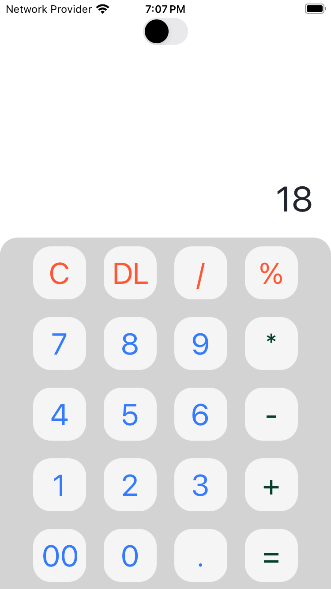
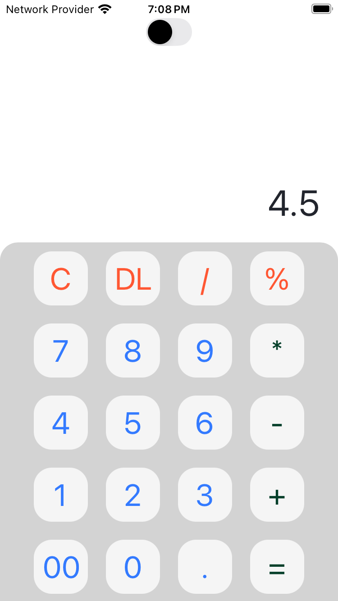

This is the loading screen of the application

The first view of the application in Light Mode

we can switch to the Dark Mode as well

we can use C (clear) button to remove everything on the input area

we can use DL (delete) button to delete the elements one by one

Here comes the real functioning of Calculator -- the operations part --->
1) Additon operation (we can use n number of digits and add them using '+' operator)

   

   The Output

   

2) Subtraction operation (we can use n number of digits and subtract them using '-' operator)

   

   The Output

   

3) Multiplication operation (we can use n number of digits and multiply them usine '+' operator)
   
   

   The Output

   

4) Division operation (we can use n number of digits and divide them usine '/' operator)

   

   The Output
   
   !

5) Modulo operation (we can use n number of digits and find remainder  usine '%' operator)

   

   The Output
   
   

